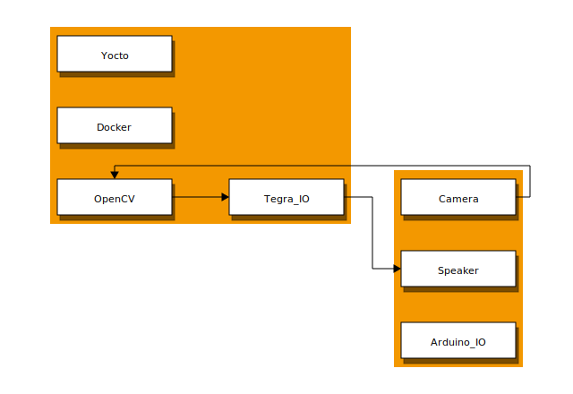

# AESD 5713 Final Course Project

## Block Diagrams

### Hardware Block Diagrams

### Software Block Diagrams 
> **_NOTE:_**  TODO

### Functional Block Diagrams
> **_NOTE:_**  TODO

## Target Build System 
We intend to use Yocto as the bring up tool to generate Linux image on NVIDIA Jetson Nano.

## Hardware Platform
Intended hardware platforms for this project:

- [Jetson Nano](https://developer.nvidia.com/embedded/jetson-nano-2gb-developer-kit)
- [Arduino Nano 33 BLE](https://store.arduino.cc/usa/tiny-machine-learning-kit)
- [OV7675 Camera](https://www.arducam.com/docs/camera-breakout-board/0-3mp-ov7675/)

## Open Source Projects 
- [Open Soruce Projects](https://github.com/cu-ecen-5013/final-project-arpit6232/blob/main/docs/open_source_projects.md)

## Previously Used Content
- Yocto
- Signal handlers
- Clocks
- Init Scripts and Rootfs Overlays

## New Content 
- Yocto Image for Jetson Nano 
- Creating Modules for Arduino BLE 33 
- USB Interface for Jetson and Arduino
- Deplying Tiny Machine Learning (TinyML)
- [Case study for TinyML](https://github.com/AESD-Course-Project/AESD-Course-Project.github.io/tree/gh-pages/docs/TinyML.md)

## Shared Material 
- [Flashing Image to SD Card](https://github.com/cu-ecen-5013/buildroot-assignments-base/wiki/Flashing-Images-to-SDCard)

## Source Code Organization 
- [Project Overview](https://github.com/AESD-Course-Project/AESD-Course-Project.github.io/blob/gh-pages/README.md)
- [Project Schedule](https://github.com/AESD-Course-Project/AESD-Course-Project.github.io/wiki/Final-Project-Assignment-Schedule-Page)
- [Caleb's Repository](https://github.com/cu-ecen-5013/final-project-CalebProvost)
- [Arpit's Repository](https://github.com/cu-ecen-5013/final-project-arpit6232)
- [Zach's Repository](https://github.com/cu-ecen-5013/final-project-ZachTurner07)

## Group's Overview 
### Team Project Members 
- Caleb: Yocto Image Setup and build for Jetson Tegra
- Zach: Communication Between Subsystems (Serial/I2C/USB/Bluetooth)
  - serial communication between subsystems
  - GPIO communication to show successful inferencing
  - Trigger on board LED for demonstration purposes
- Arpit: Machine Learning Framework and TinyML Setup for setup
  - Dive Deep into Tiny Machine Learning
  - Integrate Arduino Nano BLE and OV7675 Camera to detect Person in frame

## Schedule Page

- [Project Schedule](https://github.com/AESD-Course-Project/AESD-Course-Project.github.io/wiki/Final-Project-Assignment-Schedule-Page)

