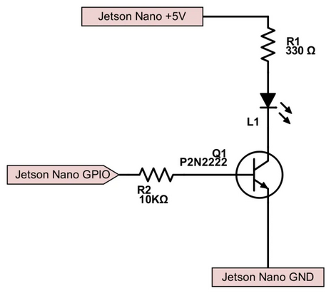
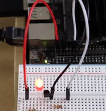

# Electronic and Hardware Setup for GPIO and Seven Segment Display

## GPIO

This Readme talks about basic electronic setup for LED on Jetson Nano

### GPIO Hardware
- 1 Qty 5mm red LED
- 1 Qty  P2N2222 Transistor
- 1 Qty 330Ω resistor
- 1 Qty  10kΩ resistor
- Hookup wire
- Breakboard

###  GPIO Setup 

### GPIO Electronic Wiring
The Collector, Base, and Emitter are different depending on which part number you have. We’re using a P2N2222 here. We will be wiring the red wire to +5V on Pin 2 on the Jetson, the black wire to GND on pin 6, and the transistor Base through the base resistor on Pin 12.

### GPIO Result 

## Seven Segment Display 

### Seven Segment Display Hardware
- 1 Qty [4 Character 7 Segment LED made by Adafruit](https://www.adafruit.com/product/880)
- Hookup wire
- Breakboard

### Seven Segment Electronic Wiring
- GND J3A1-14 -> LED Backpack (GND)
- VCC J3A1-1 -> LED Backpack (VCC – 5V)
- SCL J3A1-18 -> LED Backpack (SCL)
- SDA J3A1-20 -> LED Backpack (SDA)

## Code 
[Link to Code](https://github.com/cu-ecen-5013/final-project-arpit6232/tree/main/jetson_display)
