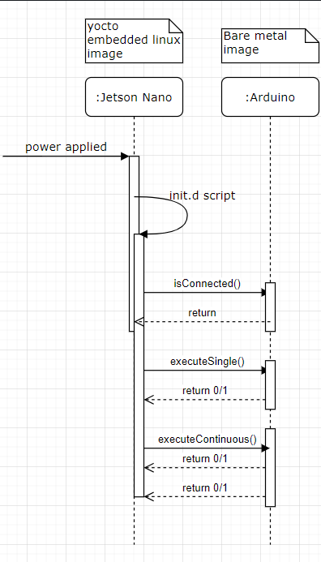

# Serial Communication

## UML Diagram

The UML sequence diagram below describes the communication flow through our application.

## Is Connected

Once the application is ran, it executes an `isConnected` which sends a byte to the Arduino to see if it is connected. The Arduino is listening for this byte (`'a'`) and responds with `acknowledge\r`. 

One TODO for this part is to validate the response from the Arduino before continuing with the application.

## Execute Human Recognition

After the application has verified the Arduino is connected, it can either the facial recognition once or continuously.

### Execute Single
If the byte `'s'` is sent to the Arduino, it will execute one loop of the facial recognition processing. The repsonse the Jetson Nano will get will be either `true` or `false` depending on the success of the processing loop.

### Execute Continous

If the byte `'c'` is sent, the Arduino will begin executing continously and continue to respond with `true` or `false`.